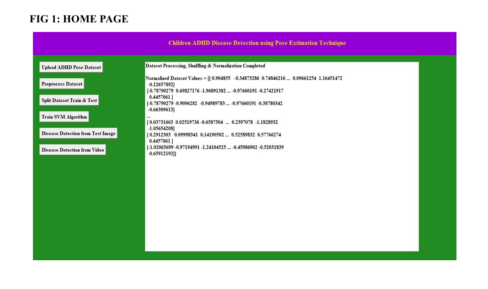
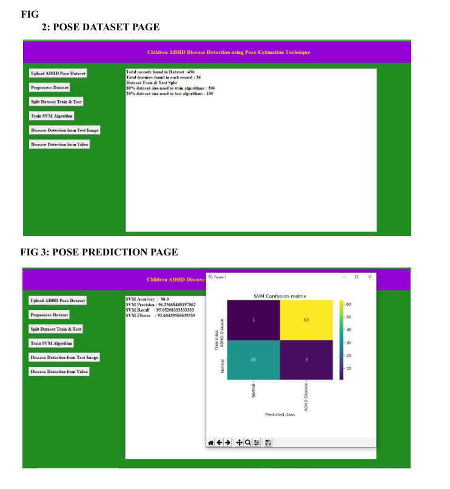
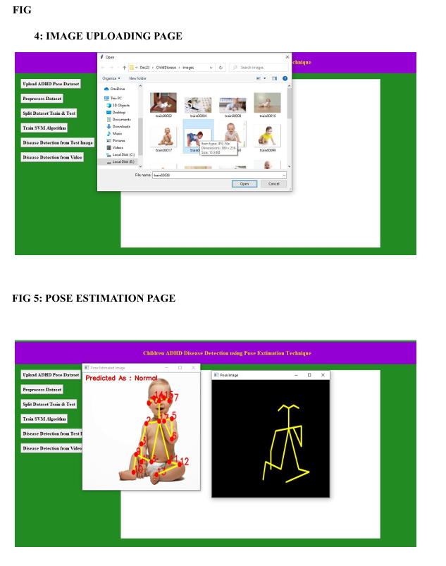
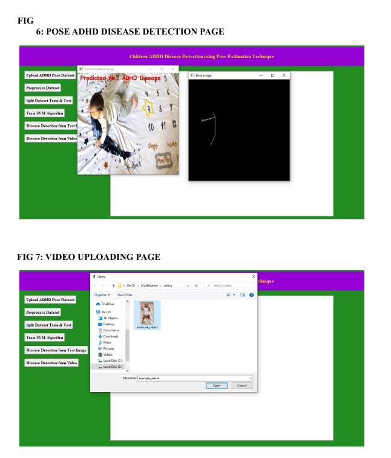
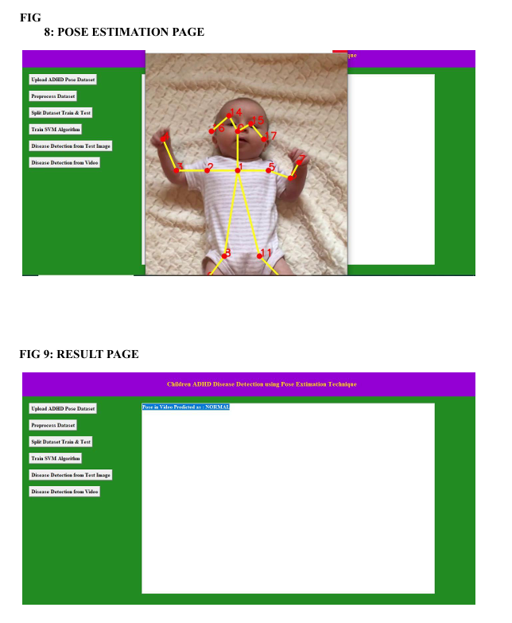
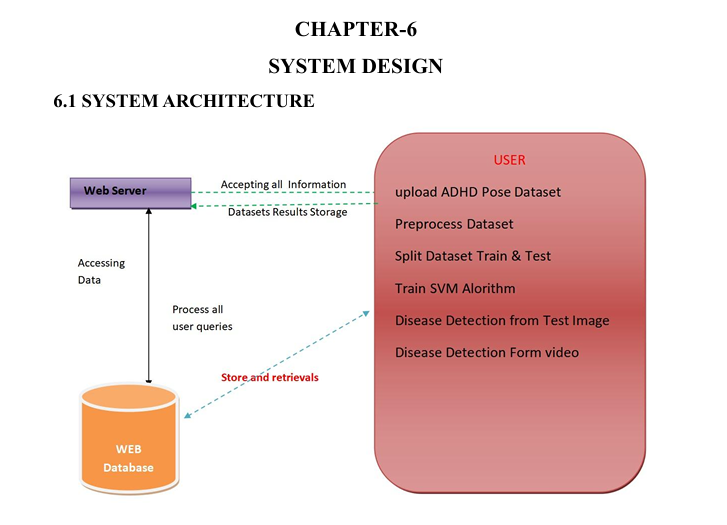
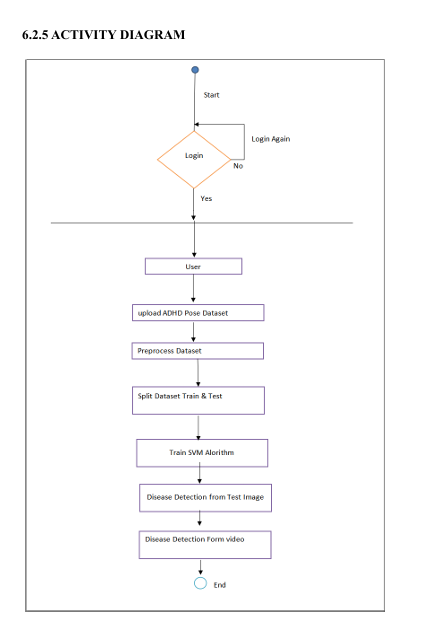
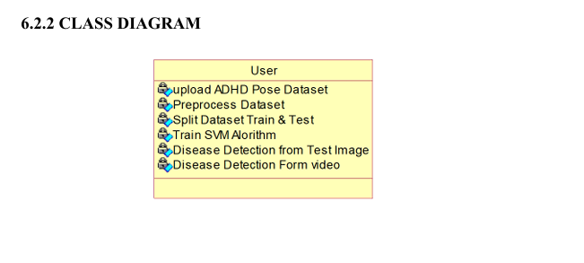
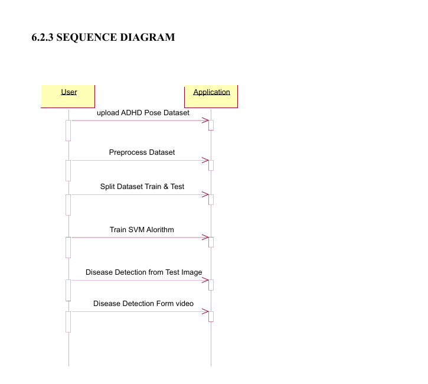
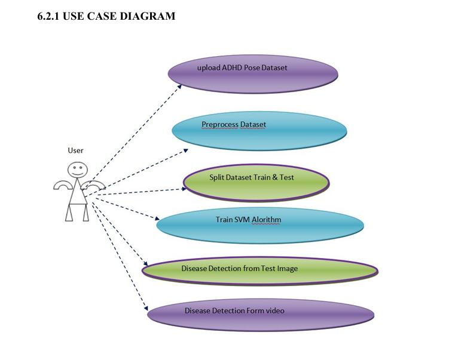

# Children ADHD Disease Detection Using Pose Estimation

### Project Description
This project is designed to detect ADHD (Attention Deficit Hyperactivity Disorder) symptoms in children by analyzing their physical movements. Using **Pose Estimation** techniques, the system monitors body landmarks to identify patterns associated with hyperactivity or lack of focus.

### Tech Stack
* **Language:** Python
* **Libraries:** OpenCV, MediaPipe, Scikit-Learn (SVM), NumPy
* **UI Framework:** Tkinter

### Key Features
* **Real-time Pose Tracking:** Captures body movements using a camera.
* **Automated Classification:** Uses Support Vector Machine (SVM) to classify behavior.
* **User-Friendly Interface:** Simple GUI for easy operation.

### How to Install and Run
1. Clone this repository or download the files.
2. Install the required libraries using:
   ```bash
   pip install -r requirements.txt
   ## Project Screenshots

### 1. Web Application Interface






## System Design & Diagrams

### Architecture Diagram


### UML Diagrams
* **Activity Diagram:** 
* **Class Diagram:** 
* **Sequence Diagram:** 
* **Usecase Diagram:** 
